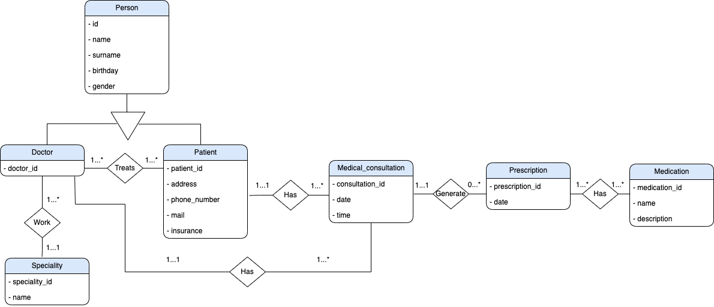
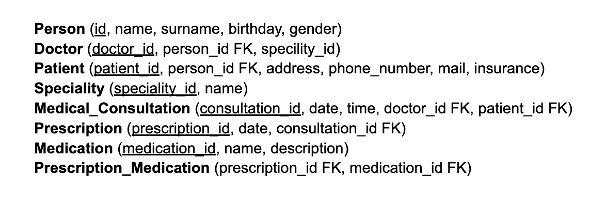

# ER_to_relational_and_normalization

In this task, the E-R model that was designed in the last unit of work will be taken to convert it into a relational model and thus reproduce the DDL code.

This task will allow us to understand how to efficiently represent the structure and relationships of data in a relational environment, which is essential for the implementation of efficient database systems.

We will be able to define tables, attributes, primary keys, foreign keys and other restrictions that will guarantee the integrity and consistency of the stored data.

## E-R Model
The first diagram is our Entity-Relationship model.

Our diagram will simulate a Hospital database, with several entities that will be related to each other. The tables will be the following:
* Person 
* Doctor
* Patient
* Speciality
* Medical Consultation
* Prescription
* Medication 

## Relational model

This is our relational model from our E-R model.

We have created our foreign keys to relate the tables as well, as we have created a new table to do the many-to-many relationship between medication and prescription.

